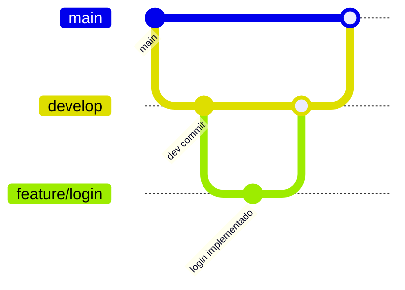

# 📦 Projeto Iris

O projeto Iris visa em ser um projeto em miniatura de uma simualação de uma rede social utilizando React com Flask.

---

## 🚀 Tecnologias Utilizadas

- React / Flask.
- Docker
- GitHub Actions / Kubernetes.
- Banco de Dados: PostgreSQL.

---

## 🌱 Fluxo de Branches


---

### ⚙️ Estrutura do Pipeline

Este projeto utiliza **GitHub Actions** para automatizar testes, build e deploy da aplicação em produção. O pipeline está dividido em três jobs principais:

#### 1. `test`
- Executado em pushes para a branch `main`.
- Realiza:
  - Checkout do repositório
  - Configuração do Node.js (versão 18)
  - Instalação das dependências com `npm ci`
  - Execução dos testes com `npm test`

#### 2. `build`
- É disparado após o job `test`.
- Etapas:
  - Criação do arquivo `.env` com os secrets do GitHub
  - Login no Docker Hub com token
  - Build da imagem Docker (`front:latest`)
  - Push da imagem para o Docker Hub

#### 3. `deploy`
- Disparado após o build.
- Etapas:
  - Conexão SSH com uma instância da Google Cloud (Compute Engine)
  - Login no Docker Hub
  - Parada e remoção do container anterior (se houver)
  - Pull da nova imagem
  - Execução do container com `--network host` e `-p 80:80`

---

### 💻 Instruções para rodar localmente

**Pré-requisitos:**
- Node.js 18+
- Docker (opcional)
- `.env` com as seguintes variáveis:

```env
VITE_API_URL=http://localhost:3000/api
VITE_ENCRYPTION_KEY=sua-chave-secreta
```

``` 
git clone https://github.com/WEBcko/iris-frontend.git
cd iris-frontend
npm install
npm run dev
```

---

### 🚢 Deploy em Produção

O deploy é feito automaticamente via **GitHub Actions**, conforme definido no arquivo `.github/workflows/main.yml`.

**Passos:**

1. Realize o **merge** da branch `develop` para `main`.
2. A pipeline será executada automaticamente com as seguintes etapas:
   -  Execução de testes com `npm test`
   -  Build da imagem Docker e push para o Docker Hub
   -  Conexão via SSH com a VM no Google Cloud
   -  Parada e remoção do container anterior (caso exista)
   -  Pull da nova imagem do Docker Hub
   -  Execução da nova imagem com `docker run --network host -p 80:80`
